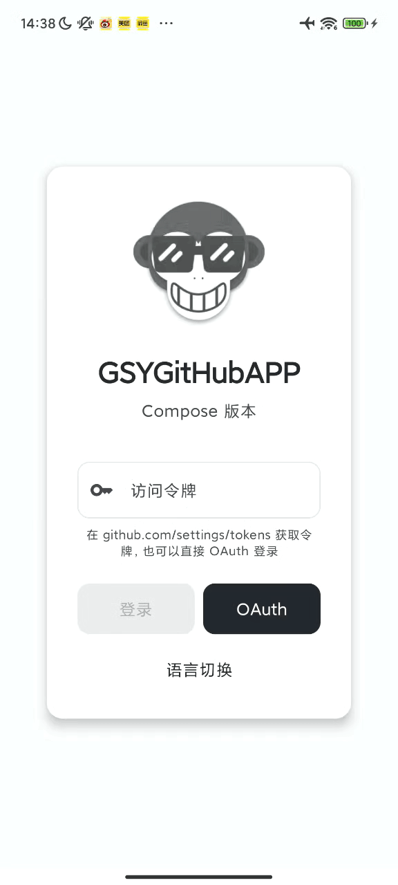
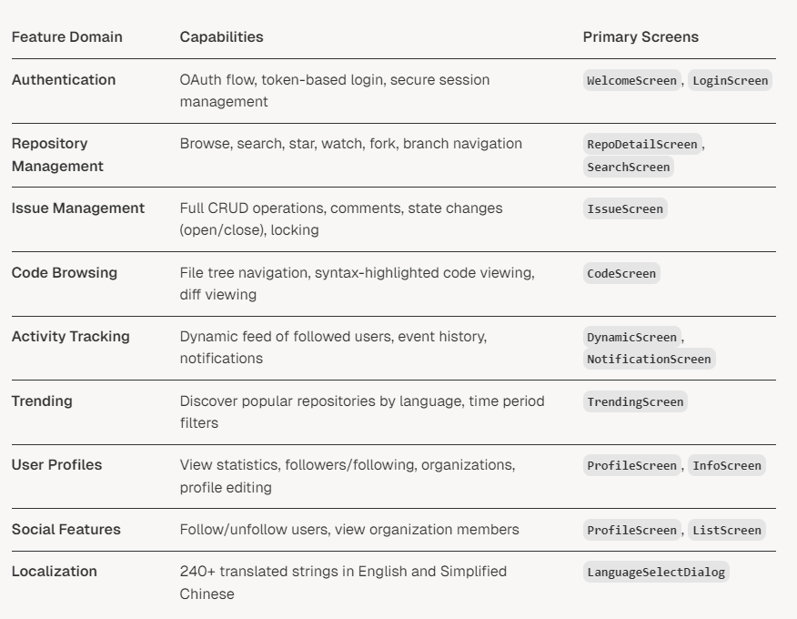
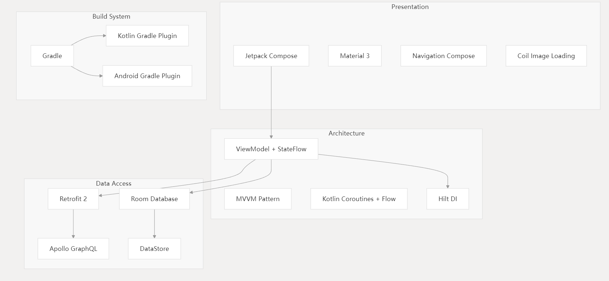
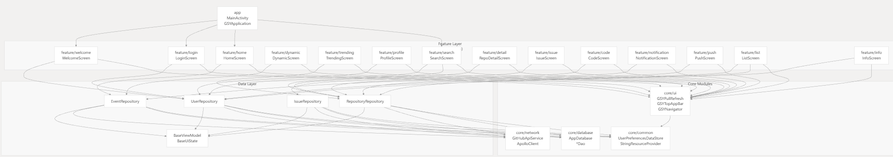
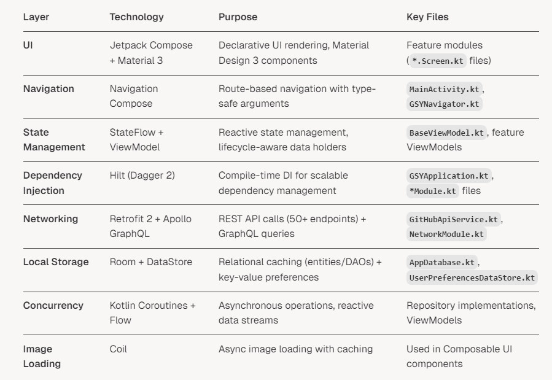
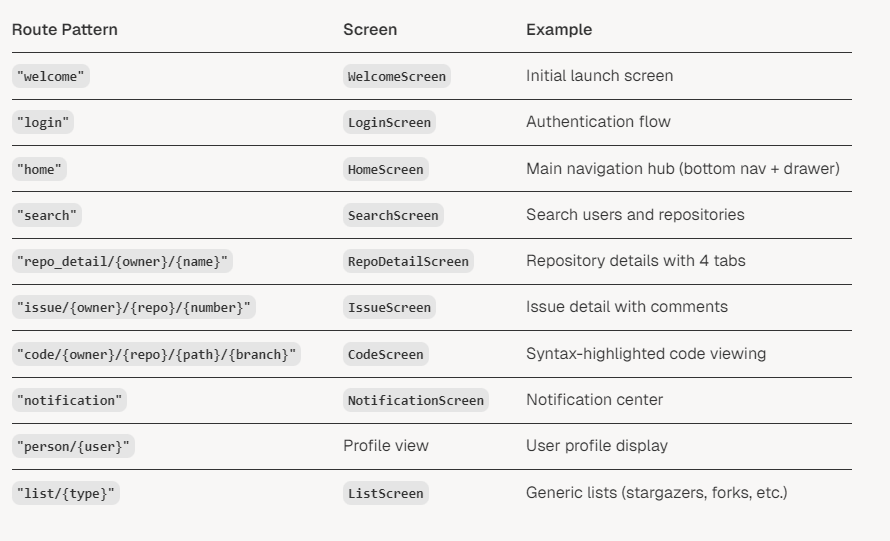
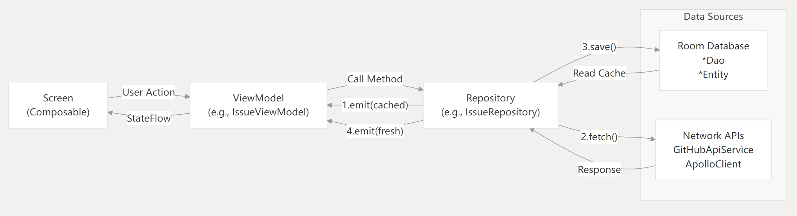

[English](README.en.md)

## 一款 Android 原生的开源 Github 客户端 App，提供更丰富的功能，更好体验，旨在更好的日常管理和维护个人 Github，提供更好更方便的驾车体验～～Σ(￣。￣ﾉ)ﾉ，项目采用 Jetpack Compose 开发，并提供丰富的同款对比：

* ### 同款 Flutter 版 （ https://github.com/CarGuo/GSYGithubAppFlutter ）
* ### 同款 Kotlin View 版 （ https://github.com/CarGuo/GSYGithubAppKotlin ）
* ### 同款 ReactNative 版 （ https://github.com/CarGuo/GSYGithubApp ）
* ### 同款 Weex 版 （ https://github.com/CarGuo/GSYGithubAppWeex ）

* ### [如果克隆太慢或者图片看不到，可尝试从码云地址下载](https://gitee.com/CarGuo/GSYGithubAppCompose)

| 公众号     | 掘金                                                          | 知乎                                        | CSDN                                    | 简书                                           
|---------|-------------------------------------------------------------|-------------------------------------------|-----------------------------------------|----------------------------------------------|
| GSYTech | [点我](https://juejin.cn/user/582aca2ba22b9d006b59ae68/posts) | [点我](https://www.zhihu.com/people/carguo) | [点我](https://blog.csdn.net/ZuoYueLiang) | [点我](https://www.jianshu.com/u/6e613846e1ea) 


```
基于 Jetpack Compose 开发的原生 Android App 。目前初版，持续完善中。

项目的目的是为方便个人日常维护和查阅 Github ，同时适合 Compose  练手学习，覆盖了各种框架的使用。

随着项目的使用情况和反馈，将时不时根据更新并完善用户体验与功能优化吗，欢迎提出问题。
```

[](https://github.com/CarGuo/GSYGithubAppCompose/actions)
[](https://github.com/CarGuo/GSYGithubAppCompose/stargazers)
[](https://github.com/CarGuo/GSYGithubAppCompose/network)
[](https://github.com/CarGuo/GSYGithubAppCompose/issues)
[](https://github.com/CarGuo/GSYGithubAppCompose/blob/master/LICENSE)

|            |            |            |            |
|------------|------------|------------|------------|
|  |  |  |  | 

## 编译运行流程

> ### 重点：你需要项目根目录下，配置 `local.properties` 文件，然后输入你申请的Github client_id 和 client_secret。

    ndk.dir="xxxxxxxx"
    CLIENT_ID = "xxxxxx"
    CLIENT_SECRET = "xxxxxx"

[      注册 Github APP 传送门](https://github.com/settings/applications/new)
，当然，前提是你现有一个github账号(～￣▽￣)～ 。

### 3、现在 Github API 需要使用安全登录（授权登录），那么在上述注册 Github App 的 Authorization callback URL 一栏必须填入

`gsygithubapp://authed`


<div>


</div>

## 项目结构图

### KeyFeatures



### Core Technologies



### Layer Structure



### Technology Stack



### Navigation Flow



### Data Flow Architecture



### 整体架构图

```
┌─────────────────────────────────────────────────────────────────────────┐
│                          GSYGithubAppCompose                            │
│                       (Jetpack Compose + MVVM)                         │
└─────────────────────────────────────────────────────────────────────────┘
                                    │
                ┌───────────────────┼───────────────────┐
                │                   │                   │
        ┌───────▼────────┐  ┌──────▼──────┐   ┌───────▼────────┐
        │  Presentation  │  │    Data     │   │      Core      │
        │     Layer      │  │    Layer    │   │     Layer      │
        └────────────────┘  └─────────────┘   └────────────────┘
                │                   │                   │
        ┌───────▼────────┐  ┌──────▼──────┐   ┌───────▼────────┐
        │   feature/*    │  │    data     │   │  core/network  │
        │                │  │             │   │  core/database │
        │ - welcome      │  │ Repository  │   │  core/common   │
        │ - login        │  │   Pattern   │   │  core/ui       │
        │ - home         │  │             │   └────────────────┘
        │ - dynamic      │  │ - User      │
        │ - trending     │  │ - Event     │
        │ - profile      │  │ - Repo      │
        │ - search       │  └─────────────┘
        │ - detail       │
        │ - code         │
        │ - issue        │
        │ - push         │
        │ - list         │
        │ - notification │
        │ - info         │
        │ - history      │
        └────────────────┘
```

### 模块依赖关系图

```
                                    ┌─────────┐
                                    │   app   │
                                    └────┬────┘
                                         │
                 ┌───────────────────────┼────────────────────────┐
                 │                       │                        │
          ┌──────▼──────┐         ┌─────▼─────┐          ┌──────▼──────┐
          │  feature/*  │         │    data   │          │   core/ui   │
          │             │         │           │          │             │
          │  所有功能模块 │◄────────┤ Repository │          │ 通用UI组件   │
          │             │         │           │          │             │
          └──────┬──────┘         └─────┬─────┘          └──────┬──────┘
                 │                      │                       │
                 │              ┌───────┼────────┐              │
                 │              │       │        │              │
                 └──────────────┼───────┼────────┼──────────────┘
                                │       │        │
                    ┌───────────▼─┐  ┌──▼────────▼──┐  ┌─────────────┐
                    │core/network │  │core/database │  │core/common  │
                    │             │  │              │  │             │
                    │ Retrofit    │  │    Room      │  │ DataStore   │
                    │ Apollo      │  │    Entity    │  │   Token     │
                    │ Model       │  │    DAO       │  │  Resources  │
                    └─────────────┘  └──────────────┘  └─────────────┘

依赖规则：
  app          → feature/*, core/ui, data
  feature/*    → data, core/ui, core/common
  data         → core/network, core/database, core/common
  core/ui      → core/common
  core/network → (独立模块)
  core/database→ (独立模块)
  core/common  → (独立模块)
```

### 模块详细结构

```
GSYGithubAppCompose/
│
├── app/                                    # 主应用模块
│   ├── MainActivity.kt                     # 主入口，导航配置
│   ├── MainViewModel.kt                    # 应用级 ViewModel
│   └── GSYApplication.kt                   # Application，Hilt 入口
│
├── core/                                   # 核心基础模块
│   │
│   ├── network/                            # 网络层
│   │   ├── api/
│   │   │   └── GitHubApiService.kt        # GitHub REST API 接口
│   │   ├── model/                          # 网络数据模型
│   │   │   ├── User.kt
│   │   │   ├── Repository.kt
│   │   │   ├── Event.kt
│   │   │   └── ...
│   │   ├── config/
│   │   │   └── NetworkConfig.kt           # 网络配置（PAGE_SIZE等）
│   │   └── di/
│   │       └── NetworkModule.kt           # Retrofit、OkHttp、Apollo DI
│   │
│   ├── database/                           # 数据库层
│   │   ├── entity/                         # Room Entity
│   │   │   ├── UserEntity.kt
│   │   │   ├── RepositoryEntity.kt
│   │   │   ├── HistoryEntity.kt
│   │   │   └── ...
│   │   ├── dao/                            # Room DAO
│   │   │   ├── UserDao.kt
│   │   │   ├── RepositoryDao.kt
│   │   │   ├── HistoryDao.kt
│   │   │   └── ...
│   │   ├── AppDatabase.kt                  # Room Database 配置
│   │   └── di/
│   │       └── DatabaseModule.kt          # Room DI
│   │
│   ├── common/                             # 公共资源模块
│   │   ├── datastore/
│   │   │   └── UserPreferencesDataStore.kt # 用户偏好存储
│   │   ├── utils/
│   │   │   └── StringResourceProvider.kt  # 字符串资源提供者
│   │   ├── di/
│   │   │   └── CommonModule.kt            # DataStore DI
│   │   └── res/                            # 公共资源
│   │       ├── values/                     # 英文资源
│   │       │   └── strings.xml
│   │       └── values-zh-rCN/              # 中文资源
│   │           └── strings.xml
│   │
│   └── ui/                                 # UI组件模块
│       ├── components/
│       │   ├── GSYPullRefresh.kt          # 下拉刷新控件
│       │   ├── GSYGeneralLoadState.kt     # 通用加载状态
│       │   ├── GSYTopAppBar.kt            # 通用标题栏
│       │   ├── GSYLoadingDialog.kt        # 加载对话框
│       │   └── ...
│       ├── navigation/
│       │   ├── GSYNavigator.kt            # 导航器
│       │   └── GSYNavHost.kt              # 导航Host
│       ├── theme/
│       │   ├── Theme.kt                    # Material 3 主题
│       │   ├── Color.kt                    # 颜色定义
│       │   └── Type.kt                     # 字体定义
│       └── base/
│           ├── BaseScreen.kt              # 基础Screen（Toast支持）
│           └── ...
│
├── data/                                   # 数据层
│   ├── repository/                         # Repository 实现
│   │   ├── UserRepository.kt               # 用户数据仓库
│   │   ├── EventRepository.kt              # 事件数据仓库
│   │   ├── RepositoryRepository.kt         # 仓库数据仓库
│   │   ├── HistoryRepository.kt            # 浏览历史数据仓库
│   │   └── vm/
│   │       ├── BaseViewModel.kt           # 基础 ViewModel
│   │       └── BaseUiState.kt             # 基础 UI 状态
│   └── mapper/
│       └── DataMappers.kt                  # 数据映射（Entity ↔ Model）
│
└── feature/                                # 功能模块
    │
    ├── welcome/                            # 欢迎页
    │   ├── WelcomeScreen.kt
    │   └── WelcomeViewModel.kt
    │
    ├── login/                              # 登录页
    │   ├── LoginScreen.kt
    │   └── LoginViewModel.kt
    │
    ├── home/                               # 主页（底部导航）
    │   ├── HomeScreen.kt
    │   └── HomeViewModel.kt
    │
    ├── dynamic/                            # 动态（事件流）
    │   ├── DynamicScreen.kt
    │   ├── DynamicViewModel.kt
    │   └── components/
    │       └── EventItem.kt
    │
    ├── trending/                           # 趋势（热门仓库）
    │   ├── TrendingScreen.kt
    │   ├── TrendingViewModel.kt
    │   └── components/
    │       └── TrendingRepoItem.kt
    │
    ├── profile/                            # 个人中心
    │   ├── ProfileScreen.kt
    │   ├── ProfileViewModel.kt
    │   └── components/
    │       └── ProfileHeader.kt
    │
    ├── search/                             # 搜索
    │   ├── SearchScreen.kt
    │   └── SearchViewModel.kt
    │
    ├── detail/                             # 仓库详情
    │   ├── RepoDetailScreen.kt
    │   └── RepoDetailViewModel.kt
    │
    ├── code/                               # 代码浏览
    │   ├── CodeScreen.kt
    │   └── CodeViewModel.kt
    │
    ├── issue/                              # Issue管理
    │   ├── IssueScreen.kt
    │   └── IssueViewModel.kt
    │
    ├── push/                               # 推送管理
    │   ├── PushScreen.kt
    │   └── PushViewModel.kt
    │
    ├── list/                               # 列表页
    │   ├── ListScreen.kt
    │   └── ListViewModel.kt
    │
    ├── notification/                       # 通知
    │   ├── NotificationScreen.kt
    │   └── NotificationViewModel.kt
    │
    └── info/                               # 信息页
        ├── InfoScreen.kt
        └── InfoViewModel.kt
    │
    └── history/                            # 浏览历史
        ├── HistoryScreen.kt
        └── HistoryViewModel.kt
```

### 技术架构图

```
┌─────────────────────────────────────────────────────────────────────┐
│                         技术栈 (Tech Stack)                          │
├─────────────────────────────────────────────────────────────────────┤
│                                                                     │
│  UI层                  Jetpack Compose + Material 3                 │
│                        Navigation Compose                           │
│                        Coil (图片加载)                               │
│                        Lottie (复杂动画)                             │
│  ├─────────────────────────────────────────────────────────────┤   │
│                                                                     │
│  状态管理              StateFlow + ViewModel                         │
│                        Kotlin Coroutines + Flow                     │
│  ├─────────────────────────────────────────────────────────────┤   │
│                                                                     │
│  依赖注入              Hilt (Dagger 2)                               │
│  ├─────────────────────────────────────────────────────────────┤   │
│                                                                     │
│  网络层                Retrofit 2 + OkHttp                           │
│                        Apollo GraphQL                               │
│                        Gson / Kotlinx Serialization                │
│  ├─────────────────────────────────────────────────────────────┤   │
│                                                                     │
│  数据库层              Room Database                                 │
│                        DataStore (替代 SharedPreferences)           │
│  ├─────────────────────────────────────────────────────────────┤   │
│                                                                     │
│  架构模式              MVVM + Repository Pattern                     │
│                        Clean Architecture                           │
│                        Unidirectional Data Flow                     │
│                                                                     │
└─────────────────────────────────────────────────────────────────────┘
```

### 数据流向图

```
┌──────────────┐        ┌──────────────┐        ┌──────────────┐
│              │        │              │        │              │
│   Screen     │◄───────┤  ViewModel   │◄───────┤  Repository  │
│  (Compose)   │ State  │   (MVVM)     │  Flow  │   (Data)     │
│              │        │              │        │              │
└──────┬───────┘        └──────┬───────┘        └──────┬───────┘
       │                       │                       │
       │ User Action           │ Business Logic        │ Data Source
       │                       │                       │
       ▼                       ▼                       ▼
┌──────────────┐        ┌──────────────┐        ┌──────────────┐
│              │        │              │        │              │
│   onClick    │───────►│  loadData()  │───────►│  Network /   │
│   onRefresh  │ Event  │  refresh()   │ API    │  Database    │
│              │        │              │ Call   │              │
└──────────────┘        └──────────────┘        └──────────────┘

数据流：
1. 用户操作触发 UI 事件
2. ViewModel 处理业务逻辑
3. Repository 协调数据源（网络/数据库）
4. 数据通过 Flow 返回到 ViewModel
5. ViewModel 更新 UiState
6. UI 自动重组显示新状态
```

### 分层职责

| 层级      | 模块                  | 职责              | 主要技术                       |
|---------|---------------------|-----------------|----------------------------|
| **表现层** | feature/*           | UI渲染、用户交互、状态展示  | Jetpack Compose、Navigation |
| **业务层** | data (ViewModel)    | 业务逻辑、状态管理、数据编排  | StateFlow、Coroutines       |
| **数据层** | data (Repository)   | 数据访问、缓存策略、数据映射  | Repository Pattern         |
| **网络层** | core/network        | API调用、网络请求、数据模型 | Retrofit、Apollo、OkHttp     |
| **存储层** | core/database       | 本地缓存、数据持久化      | Room、DataStore             |
| **基础层** | core/common、core/ui | 公共工具、UI组件、资源    | 多语言、主题、工具类                 |

## 下载

#### Apk下载链接： [Apk下载链接](https://github.com/CarGuo/GSYGithubAppCompose/releases)

### 示例图片（截图并非完全对应）


### 感谢


https://deepwiki.com/CarGuo/GSYGithubAppCompose

### LICENSE

```
CarGuo/GSYGithubAppFlutter is licensed under the
Apache License 2.0

A permissive license whose main conditions require preservation of copyright and license notices.
Contributors provide an express grant of patent rights.
Licensed works, modifications, and larger works may be distributed under different terms and without source code.
```
